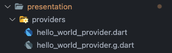
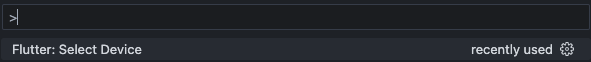
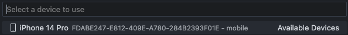
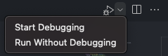
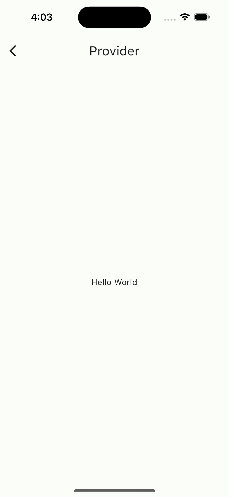

## Tabla de contenido.
- [riverpod\_app](#riverpod_app)
  - [Getting Started](#getting-started)
  - [Riverpod](#riverpod)
    - [Provider de sólo lectura](#provider-de-sólo-lectura)
      - [Probar en Mac](#probar-en-mac)
  - [State Provider](#state-provider)


# riverpod_app

A new Flutter project.

## Getting Started

This project is a starting point for a Flutter application.

A few resources to get you started if this is your first Flutter project:

- [Lab: Write your first Flutter app](https://docs.flutter.dev/get-started/codelab)
- [Cookbook: Useful Flutter samples](https://docs.flutter.dev/cookbook)

For help getting started with Flutter development, view the
[online documentation](https://docs.flutter.dev/), which offers tutorials,
samples, guidance on mobile development, and a full API reference.


## Riverpod

## Curso tomado de [Devtalles](https://cursos.devtalles.com)


[Doc riverpod](https://docs-v2.riverpod.dev/docs/getting_started)

1. Instalar las dependencias recomendadas para su uso.

- colocar el siguiente código en una terminar y dar `enter`.
```bash
flutter pub add \
  flutter_riverpod \
  riverpod_annotation \
  dev:riverpod_generator \
  dev:build_runner \
  dev:custom_lint \
  dev:riverpod_lint
```

2. Ejecutar comando build runner para que tome los cambios de riverpod.
```bash
dart run build_runner watch
```

3. Para habilitar `riverpod_lint/custom_lint`, agregar el siguiente código en el archivo `analysis_options.yaml`.

```yaml
analyzer:
  plugins:
    - custom_lint
```

- Para ejecutar el Lint riverpod.
    ```bash
    dart run custom_lint
    ```

4. Para usar riverpod en nuestro proyecto se debe hacer unos cambios en el archivo `main.dart`.

    - Envolver el widget de runApp en un ProviderScope.

        - Antes:
        ```dart
        void main() {
            runApp(const MyApp());
        }
        ```
        - Ahora:
        ```dart
        void main() {
            runApp(const ProviderScope(
                child: MyApp(),
                ),
            );
        }
        ```
    - Además convertir el StatelessWidget o StatefulWidget en un ConsumerWidget, lo cual requiere agregar un nuevo parámentro en el build un WidgetRef.
    ```dart
    class MyApp extends ConsumerWidget {
        @override
        Widget build(BuildContext context, WidgetRef ref) {

            return MaterialApp(
                home: Scaffold(
                    appBar: AppBar(title: const Text('Provider')),
                    body: Center(
                        child: Text('Hello World'),
                    ),
                ),
            );
        }
    }
    ```

### Provider de sólo lectura

- En la carpeta de presentation podemos agregar una nueva llamada providers para agregar allí todos los que se necesiten en la aplicación.

```bash
presentation -> providers

```

- Como ejemplo podemos crear el archivo: `hello_world_provider.dart`

- Dentro del archivo creamos un método o función que va a devolver un valor. En este devuelve un String con el valor 'Hello World'.

```dart
String helloWorld(Ref ref) {
  return 'Hello World';
}
```

- El parámetro de entrada se debe llamar igual al `nombre de la función + la palabra Ref` = `HelloWorldRef` con esto el generador de código que dejamos corriendo en el punto 2 de las configuraciones se encargará de crearlo.

    Quedaría de esta manera:
    ```dart
    String helloWorld(HelloWorldRef ref) {
    return 'Hello World';
    }
    ```

- Pero hace falta agregar una anotación y una importación para que el generador de código de riverpod pueda generar correctamente el archivo del provider.

    - La anotación es @riverpod, necesaría para generar el archivo del provider.
    - La "importación" sería con la palabra part + el nombre del archivo generado anteriormente  + .g. `part 'hello_world_provider.g.dart';`.

    Así quedaría el código:
    ```dart
    part 'hello_world_provider.g.dart';

    @riverpod
    String helloWorld(HelloWorldRef ref) {
    return 'Hello World';
    }
    ```
    Luego podemos guardar los cambios y el generador que está corriendo, se encargada de generar un nuevo archivo `hello_world_provider.g.dart`.
    
    

- Ahora, para acceder a este Provider(helloWorldProvider) de sólo lectura, se haría de la siguiente manera:

> Dentro del `build(BuildContext context, WidgetRef ref)` de un ConsumerWidget, podemos acceder al Provider usando la función `watch` del `WidgetRef`, la cual recibe como parámetro el nombre del Provider generado `helloWorldProvider` y se puede usar en otro Widget.

Así quedaría como un ejemplo:

```dart
    class MyApp extends ConsumerWidget {
        @override
        Widget build(BuildContext context, WidgetRef ref) {
            final String helloWorld = ref.watch(helloWorldProvider);

            return MaterialApp(
                home: Scaffold(
                    appBar: AppBar(title: Text('Provider')),
                    body: Center(
                        child: Text(value),
                    ),
                ),
            );
        }
    }
```

También dentro de una función se debe usar el `read` y no el `watch`.
```dart
ref.read(appRouterProvider).pop();
```


#### Probar en Mac

1. Para probarlo podemos ingresar a una terminal, en este caso de Mac ejecutar el comando:

```bash
open -a simulator
```

Este se encarga de abrir un simulador o emulador de iOS.


2. Ir a Visual Studio Code y ejecutar el comando `command + shift + P` allí escribir `Flutter: Select device` y seleccionar el emulador que abrimos.





3. Después de tener el emulador seleccionado, podemos instalar y ejecutar la aplicación allí, hay varias formas de hacerlo:

    - Abrir el archivo `main.dart` y en la parte superior derecha tenemos 2 opciones iniciar con debug (***Start Debugging***) o sin debug(***Run Without Debugging***).

    

    - Otra opción es presionar la tecla `F5 (fn + F5)`.
    - Una más sería abrir una terminal y ejecutar el comando `flutter run`.


    

| :blush: `:blush:` | :smiley: `:smiley:` | :relaxed: `:relaxed:` |

## State Provider

- Creamos un nuevo archivo `state_providers.dart` para tener allí los providers de estados. Estos providers tienen la particularidad de que son una clase y pueden tener métodos o funciones que cambien el estado del provider. Aquí tenemos una que incrementa en 1 el estado.

```dart
import 'package:riverpod_annotation/riverpod_annotation.dart';

part 'state_providers.g.dart';

@riverpod
class Counter extends _$Counter {
  @override
  int build() => 5;

  void increaseByOne() {
    state++;
  }
}
```

Los pasos para su uso son iguales que para los Providers de sólo lectura.

Algo que si es diferente respecto a los providers de sólo lectura, es la forma en que se usa dentro de las funciones, para acceder a la función `increaseByOne` del **Counter Provider** por ejemplo, se hace utilizando un notificador `notifier` el cual nos da alcance a las funciones de la clase.

```dart
ref.read(counterProvider.notifier).increaseByOne();
```
 
Los **State Provider** mantienen el estado sobre el Widget que se esté utilizando, una vez que se sale de éste se reinicia el estado. Una opción para mantenerlo siempre es usar la anotación `@Riverpod(keepAlive: true)` reemplazando la anotación `@riverpod` de las clases.

```dart
import 'package:riverpod_annotation/riverpod_annotation.dart';

part 'state_providers.g.dart';

@Riverpod(keepAlive: true)
class Counter extends _$Counter {
  @override
  int build() => 5;

  void increaseByOne() {
    state++;
  }
}
```
